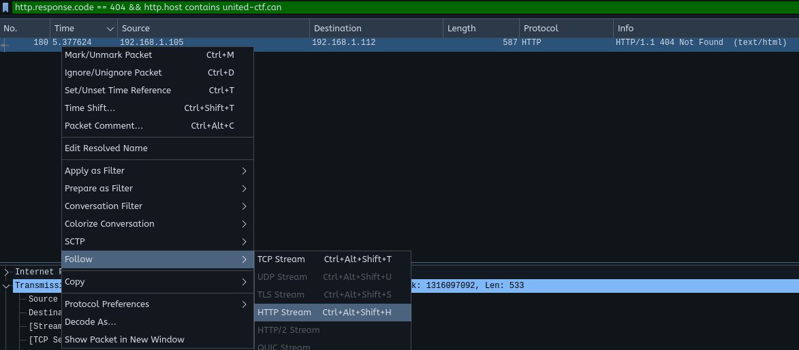
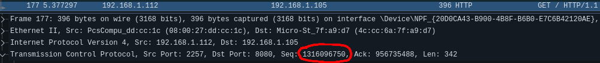

# Writeup

Une erreur de page non-trouvée correspond au code de status `404 - Not Found`. On peut donc utiliser le filtre suivant pour réduire le nombre de paquets à regarder.

```
http.response.code == 404
```

Comme le nom du serveur est donnée, on peut raffiner le filtre à:

```
http.response.code == 404 && http.host contains united-ctf.can
```

Une fois que nous avons identifié le paquet qui contient la réponse, on peut facilement retrouver la requête un utilisant la fonctionnalité _follow HTTP Stream_ de `Wireshark`



Ensuite, le numéro de séquece est disponible dans la section TCP du paquet:



Celui-ci est: `1316096750`
