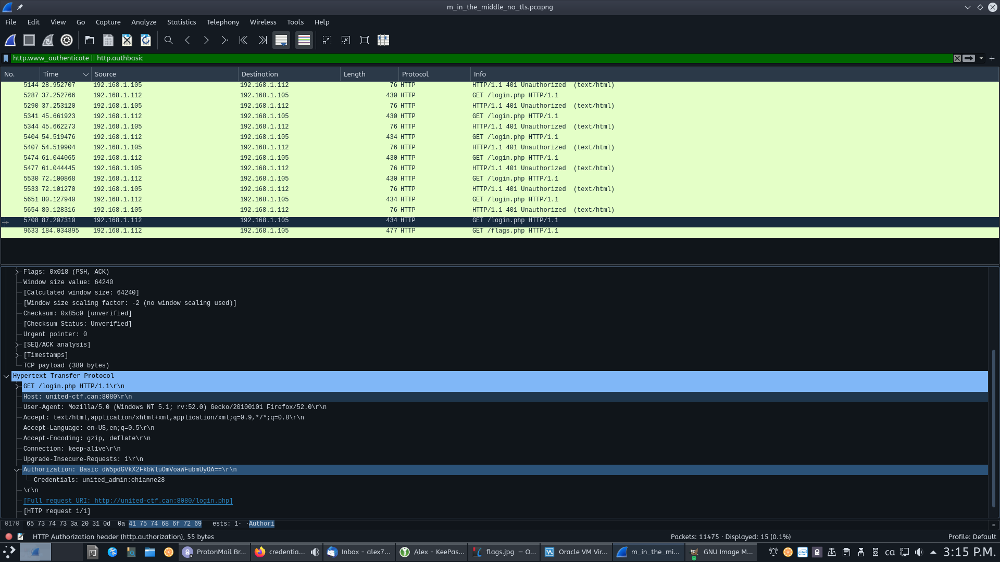

# Writeup

On peut d'abord voir toutes les requêtes incluant un _Header_ `Authorization` ainsi que les réponses où ces tentatives d'authentification ont été refusées en utilisant le filtre suivant:

```
http.www_authenticate || http.authbasic
```

On peut voir plusieurs requêtes vers `/login.php` et l'une seule d'entre elles n'est pas accompagnée d'une réponse `401 - Unauthorized`.

En allant dans les détails de cette requête dans la section `HTTP > Authorization`, nous pouvons voir les identifiants utilisés:



Le mot de passe est `ehianne28`.
