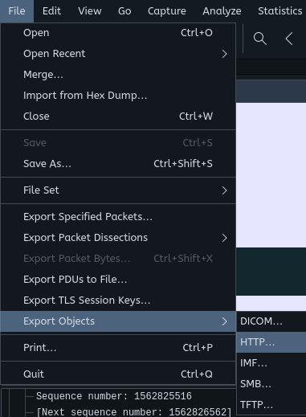

# Writeup

Il est possible d'exporter les fichiers transmis en utilisant la fonctionnalité _export Objects_ de `Wireshark`.



Beaucoup d'images ont été transmises. Il est possible de toutes les exporter et de les regarder manuellement, mais il y en a une qui sort du lot car elle provient du même serveur que les deux derniers flags::

```
image/jpg: united-ctf.can:8080/flags.php
```

En l'exportant, on obtient:


`FLAG-ALL_FLAGS_ARE_BEAUTIFUL_iv3nR8NxQPnq`
