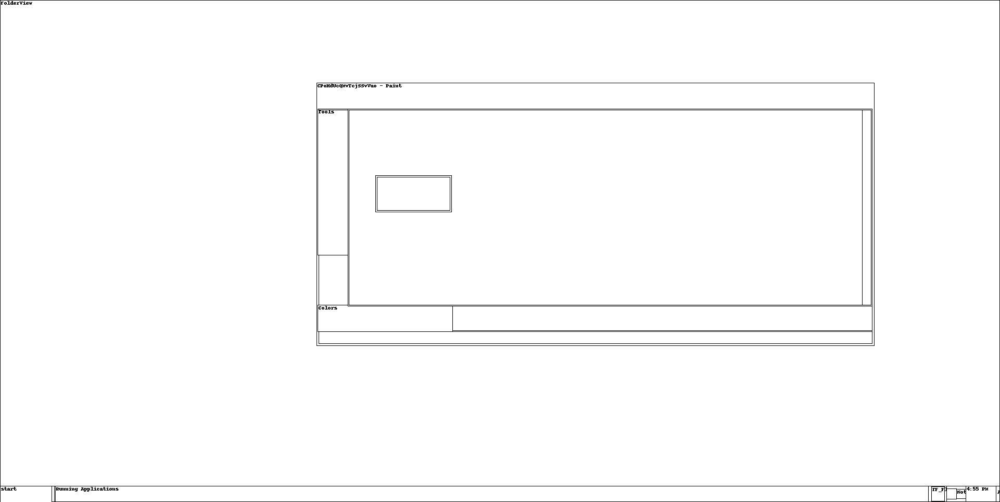

# Writeup

Le flag est dans le titre d'une fenêtre visible sur le desktop.

On peut utiliser le module `screenshot` de volatility pour en avoir une vue en wireframe

```shell
volatility screenshot -f /path/to/volatile_mem.dmp -D /output/path/for/screenshots
```



`CPoHdUcQMvTcjSSvVuo`
